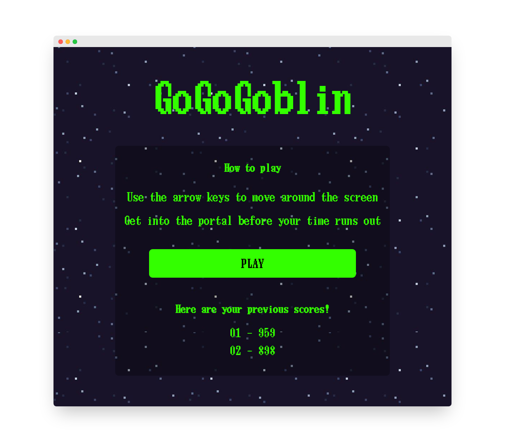
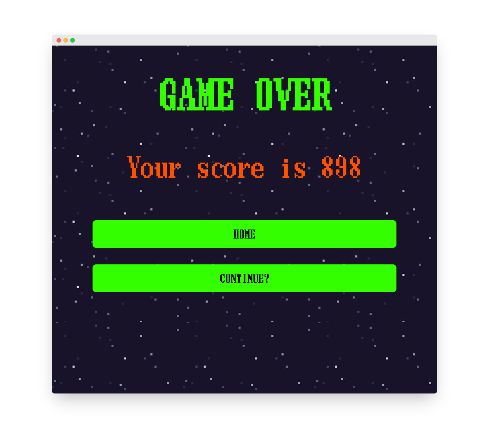

# WEEK 05 React Project

## GoGoGoblin 🍄

Retro browser based game, can you help Goblin get home? 🏠

### 🧱 Features

- [x] Control Goblin with keyboard
- [x] AI powered portal
- [x] High scores
- [x] Retro styling

### 📚 What we learnt

- `useState` is very useful
- `useEffect` is a confusing beast
- `updateState(val + 1)` vs `updateState((oldVal) => oldVal +1)` are very different!

### ⏳ Future improvements

- [ ] Login for storing highscores
- [ ] Global highscores
- [ ] Challenge a friend

### 👀 Screenshots

